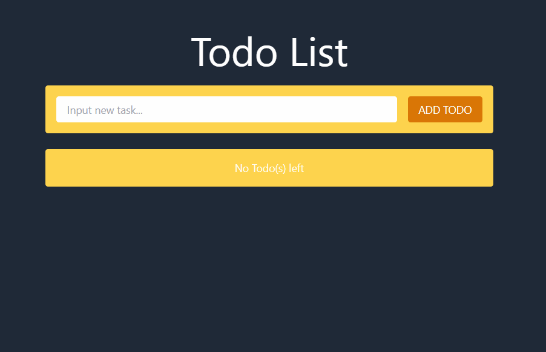

# Todo List App built with MERN Stack + TailwindCSS

## Install npm dependencies for backend/server
```
npm install
```

## Install npm dependencies for frontend/client
```
cd client && npm install
```

## Run Backend & Frontend
```
npm run dev
```

## Preview
